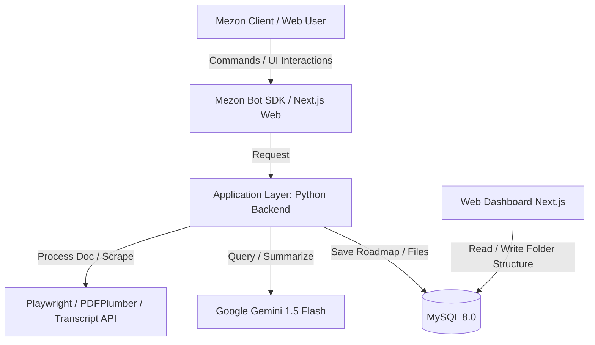

# Mezon Knowledge Hub Bot (AI-KHB) - Mezon MindFolder AI

Trợ lý AI biên soạn, phân loại và quản lý tri thức đa phương tiện dưới dạng cây thư mục trực tiếp trên nền tảng Mezon.

---

## 1. Tổng Quan Dự Án & Mục Tiêu

### Vấn đề (Problem Statement)
Người dùng trên các nền tảng chat (như Mezon, Discord) thường bị quá tải thông tin. Việc đọc các tài liệu dài, xem các video hàng chục phút, hoặc tự đi tìm kiếm dữ liệu trên Google tốn rất nhiều thời gian. Đồng thời, việc lưu trữ file lộn xộn trong khung chat khiến thông tin dễ bị trôi và thất lạc.

### Giải pháp (Solution)
Xây dựng một Bot AI hoạt động như một **Trung tâm xử lý tri thức (Knowledge Hub)**. Bot nhận yêu cầu từ người dùng, tự động thu thập thông tin (từ Web, tài liệu tải lên, video Youtube), sử dụng AI xử lý & tóm tắt, sau đó đóng gói gọn gàng vào các cấu trúc **Thư mục ảo (Virtual Folders)** dưới định dạng Markdown (.md) và đồng bộ lên Web Dashboard để quản lý trực quan.

### Mục tiêu (Objectives)
* Trở thành bot dẫn đầu về hiệu suất (Productivity) và quản lý tri thức bằng AI (AI Knowledge Management) trên hệ sinh thái Mezon.
* Xây dựng giao diện Web Dashboard trực quan, tối giản, mượt mà trên cả Desktop và Mobile.

---

## 2. Các Tính Năng Cốt Lõi (MVP Scope)

### 2.1. Khởi tạo Tri thức từ Internet (Prompt-to-Folder)
* **Mô tả:** Người dùng đưa ra chủ đề nghiên cứu qua chat. Bot tự tìm kiếm, tổng hợp và phân loại thành thư mục.
* **Luồng xử lý:**
  1. User gõ lệnh: `/roadmap [Chủ đề cần học]`
  2. Bot sử dụng Tavily Search API để tìm kiếm 5-10 bài viết/báo cáo uy tín.
  3. Bot cào nội dung văn bản thô từ các nguồn đó.
  4. Gửi dữ liệu thô qua Gemini 1.5 Flash API để tổng hợp thành tài liệu có cấu trúc (Tổng quan, Số liệu thống kê, Xu hướng tương lai).
  5. Tạo thư mục ảo, lưu file `Tong_quan.md` vào Database.
  6. Trả về tin nhắn dạng Rich Embed kèm nút bấm `[📁 Mở Thư Mục]` và `[🌐 Mở Web Dashboard]`.

### 2.2. Tiêu hóa & Cấu trúc Tài liệu Nội bộ (Doc-to-Styled Summary)
* **Mô tả:** Người dùng tải lên các file tài liệu dài, Bot đọc hiểu và bóc tách thành các file tóm tắt có cấu trúc khoa học trong folder riêng.
* **Luồng xử lý:**
  1. User gõ lệnh `/digest` kèm file đính kèm (`.pdf` hoặc `.docx`).
  2. Bot tải file, trích xuất văn bản thô (sử dụng `pdfplumber` hoặc `python-docx`).
  3. Chia nhỏ văn bản thành các đoạn (chunks) và gửi qua Gemini API để phân tích theo cấu trúc chuẩn: Mục lục, Tóm tắt cốt lõi, Chi tiết từng chương, Hành động/Lưu ý quan trọng.
  4. Lưu các file tóm tắt dưới dạng `.md` vào thư mục của User trong Database.

### 2.3. Rút gọn Video Đa phương tiện (Video-to-Markdown)
* **Mô tả:** Tóm tắt video Youtube dài, bóc tách nội dung chính kèm mốc thời gian (Timestamp) để người dùng nắm bắt 100% nội dung mà không cần xem hết video.
* **Luồng xử lý:**
  1. User gõ lệnh: `/youtube [Đường link video YouTube]`
  2. Bot trích xuất Video ID, gọi API lấy phụ đề (Transcript) kèm mốc thời gian.
  3. Gửi Transcript qua AI để biên soạn lại thành các phân đoạn Markdown có gắn Timestamp (ví dụ: `00:00 - 05:15: Đặt vấn đề...`).
  4. Tạo file `Video_Summary_[ID].md` lưu vào folder chỉ định của User.

### 2.4. Web Dashboard trực quan
* Hiển thị danh sách thư mục ảo dạng cây thư mục (Folder Tree) ở Sidebar bên trái.
* Khung màn hình chính (File Viewer) hiển thị nội dung Markdown cực đẹp (hỗ trợ render table, to-do list, highlight).
* Tích hợp Video Player nhỏ ở góc đối với file tóm tắt video để vừa đọc tóm tắt vừa xem đoạn video tương ứng qua mốc thời gian.

---

## 3. Kiến Trúc Hệ Thống & Tech Stack



### Chi tiết Tech Stack
* **Frontend:** Next.js (React) + Tailwind CSS + Lucide Icons + React-markdown (kèm remark-gfm và typography plugin).
* **Backend Bot:** Python 3.10+ (Asynchronous) + Mezon-SDK + websockets + mysql-connector-python.
* **AI Engine:** Google Gemini 1.5 Flash API (Context Window 1 triệu tokens) + Tavily Search API.
* **Database:** MySQL 8.0 (Quản lý cấu trúc cây thư mục quan hệ Cha - Con, lưu trữ các file Markdown).
* **Công cụ cào & xử lý dữ liệu:**
  * Playwright & BeautifulSoup4: Cào văn bản từ trang web.
  * PDFPlumber: Trích xuất text và bảng biểu từ PDF.
  * python-docx: Trích xuất text từ Word.
  * youtube-transcript-api: Lấy phụ đề từ YouTube.

---

## 4. Cấu Trúc Thư Mục (Monorepo Structure)

```
mezon-knowledge-hub/
├── .env.example             # File mẫu cấu hình biến môi trường (Secrets, DB, Token)
├── docker-compose.yml       # File đóng gói môi trường chạy Docker cho toàn hệ thống
├── README.md                # Tài liệu hướng dẫn setup dự án
│
├── bot/                     # [BACKEND] Python Mezon Bot Xử lý Tri thức
│   ├── src/
│   │   ├── main.py          # Điểm khởi chạy Bot kết nối WebSocket Mezon
│   │   ├── database.py      # Xử lý kết nối MySQL
│   │   └── services/
│   │       ├── ai_engine.py # Xử lý tích hợp Google Gemini 1.5 Flash API
│   │       ├── scrapers.py  # Cào text web (Playwright) & lấy transcript Youtube
│   │       └── document.py  # Trích xuất dữ liệu file (PDFPlumber, Docx)
│   ├── Dockerfile
│   └── requirements.txt     # Các thư viện Python (mezon-sdk, pdfplumber,...)
│
└── web-dashboard/           # [FRONTEND] Next.js (React) + Tailwind UI
    ├── src/
    │   ├── app/             # Next.js App Router (Dashboard UI)
    │   ├── components/      # Sidebar cây thư mục, FileViewer hiển thị Markdown
    │   └── hooks/           # Các Custom hook gọi API lấy dữ liệu từ MySQL
    ├── Dockerfile
    ├── package.json
    └── tailwind.config.js
```

---

## 5. Các Câu Lệnh Bot Hỗ Trợ

| STT | Câu lệnh (Command) | Cú pháp (Syntax) | Mô tả ngắn (Description) |
| :--- | :--- | :--- | :--- |
| 1 | `/roadmap` | `/roadmap [Chủ đề cần học]` | Tìm kiếm thông tin trên Internet, gọi Gemini Flash thiết lập lộ trình học tập và tạo thư mục bài học mới. |
| 2 | `/digest` | `/digest` (kèm đính kèm file) | Bóc tách văn bản thô từ file PDF/Word, tóm tắt nội dung thành các file Markdown và lưu vào cây thư mục ảo. |
| 3 | `/youtube` | `/youtube [Link video Youtube]` | Cào phụ đề video Youtube, tóm tắt nội dung từng phân đoạn kèm mốc thời gian Timestamp. |
| 4 | `/dashboard` | `/dashboard` | Trả về URL trực tiếp truy cập vào không gian làm việc cá nhân trên Web Dashboard. |
| 5 | `/help` | `/help` | Hiển thị bảng danh mục hướng dẫn sử dụng và cú pháp mẫu của tất cả các câu lệnh. |

---

## 6. Kế Hoạch Phát Triển (Project Phases)

* **Phase 1: (UI/UX, ERD & DB)**
  * Cả Team: Thiết kế wireframe UI/UX Web Dashboard, thống nhất API JSON format.
  * Backend: Thiết kế sơ đồ quan hệ thực thể ERD (folders, knowledge_files).
  * Frontend: Khởi tạo dự án Next.js, cấu hình Tailwind CSS và cài đặt Base UI Theme.
* **Phase 2:**
  * Backend: Kết nối cổng Mezon Gateway qua WebSockets, viết Module Scraper bóc tách Subtitle YouTube và đọc file PDF/Word.
  * Frontend: Thiết kế khung Layout chính, dựng Sidebar TreeView hiển thị danh sách thư mục và file bằng Mock Data.
* **Phase 3:**
  * Backend: Tích hợp API Gemini 1.5 Flash + Tavily, xây dựng Prompt hệ thống và dựng API Server.
  * Frontend: Cài đặt react-markdown render bài học, nhúng YouTube Player API và viết logic tua video bằng Timestamp.
* **Phase 4:**
  * Backend: Cấu hình CORS để cho phép Frontend kết nối.
  * Frontend: Kết nối API, chuyển đổi từ Mock Data sang API thật.
  * Cả Team: Test luồng thực tế (End-to-End) từ khi gõ lệnh trên Mezon Chat đến hiển thị trên Web.
* **Phase 5:**
  * Backend: Viết Dockerfile cho Bot Python và thiết lập cơ chế tự tạo bảng MySQL.
  * Frontend: Viết Dockerfile cho Next.js Web và hoàn thiện tài liệu báo cáo SRS.
  * Cả Team: Viết file `docker-compose.yml` ở thư mục gốc để liên kết 3 Container và hoàn thiện file `README.md`.

---

## 7. Hướng Dẫn Setup Nhanh Với Docker

1. Sao chép file cấu hình môi trường:
   ```bash
   cp .env.example .env
   ```
2. Điền đầy đủ thông tin API key và Token vào file `.env`:
   * `MEZON_BOT_TOKEN`: Token lấy từ Mezon Developer Portal.
   * `GEMINI_API_KEY`: API Key lấy từ Google AI Studio.
   * `TAVILY_API_KEY`: API Key lấy từ Tavily Search API.
   * `DB_ROOT_PASSWORD`: Mật khẩu cơ sở dữ liệu MySQL của bạn.
3. Khởi chạy hệ thống:
   ```bash
   docker compose up -d --build
   ```
